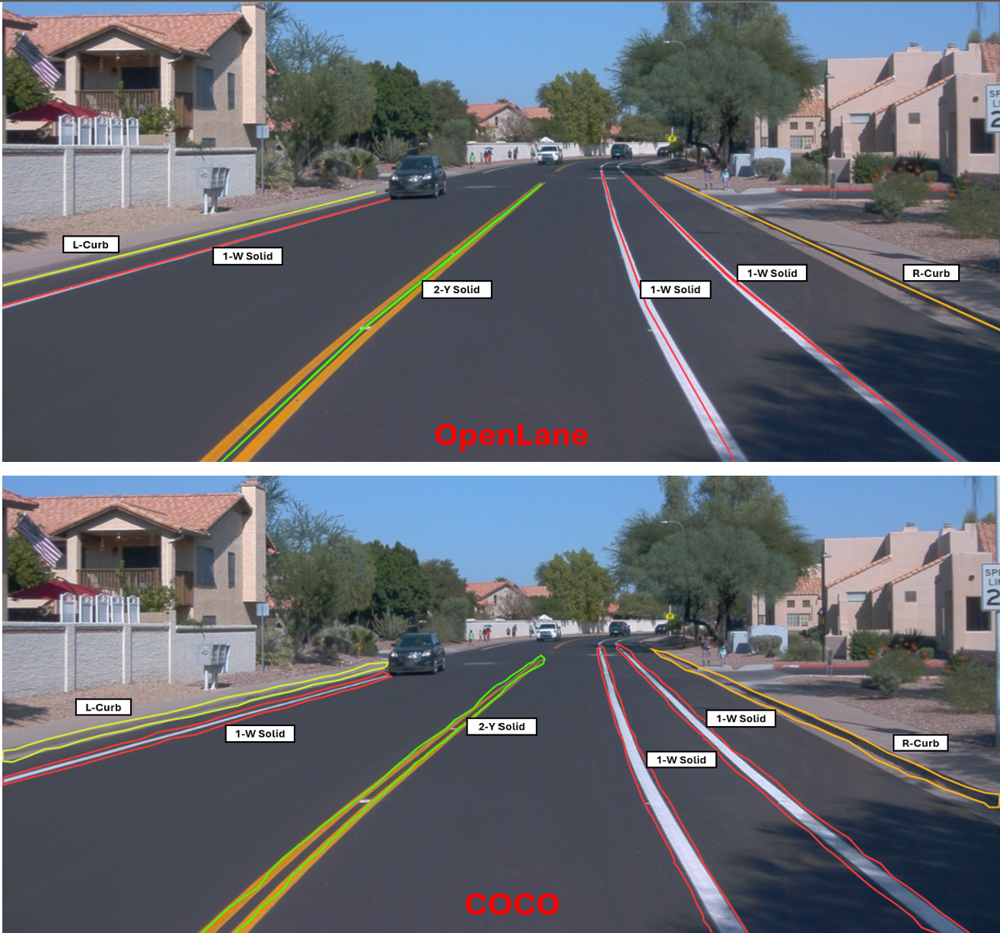

# OpenLANE to COCO Dataset Translation Using Python

## Overview

This project provides tools to convert the OpenLANE dataset, which primarily represents lane information as point coordinates, into the COCO format, which is widely used for object detection tasks. The conversion allows lanes to be treated as objects, enabling classification into various lane types such as solid, dashed, and curbs.

## What are OpenLANE and COCO?

- **OpenLANE**: A dataset used for lane detection tasks where lanes are represented by point coordinates.
- **COCO**: A large-scale object detection, segmentation, and captioning dataset. It is extensively used in the computer vision community.

## Project Functionality

The provided scripts convert the lane points in the OpenLANE dataset into segmentation masks in the COCO format. This enables the use of standard object detection techniques by treating lanes as objects, which can then be classified into different lane types like solid, dashed, etc.

### Conversion Process

The image above illustrates the process of converting OpenLANE annotations into COCO segmentation masks, allowing each lane line to be represented as a separate object with a classification.

## Script Descriptions

The repository includes several scripts, each serving specific purposes in the conversion process:

1. **coco_view**: Allows visualization of the COCO dataset annotations, helpful for verifying the conversion process.
2. **Open2coco**: The main script that initiates the conversion from OpenLANE to COCO format.
3. **openlane2coco**: A straightforward script for converting single OpenLANE files to COCO segmentation format.
4. **openlane2cocoMultiFiles**: Handles the conversion of multiple OpenLANE files to COCO format in batch mode.
5. **openlane2cocoMultiFiles_withOffset**: Extends the multi-file conversion by adding support for offsetting the lane points to create thicker lanes in the COCO format.
6. **openlane2cocoMultiFiles_withOffset_supportForDifLanes**: An advanced version of the script that supports different lane types with specific offsets for each type.

## Detailed Explanation of `openlane2cocoMultiFiles_withOffset_supportForDifLanes`

This script is the most advanced in the project, supporting different lane types and applying specific offsets for each. Here's how it works:

- **Lane Line Classification**: The script classifies lane lines into categories like white solid, yellow dashed, curbs, etc., using the `category_names` dictionary.
- **UV to COCO Segmentation**: It converts the UV coordinates from the OpenLANE dataset into COCO segmentation format, optionally applying an offset to create lane thickness.
- **Douglas-Peucker Algorithm**: The script uses this algorithm to reduce the number of points in a lane line, simplifying the segmentation mask.
- **Bounding Box Calculation**: A bounding box is calculated for each lane line based on its UV coordinates.
- **COCO Data Assembly**: The script assembles the COCO JSON file, including images, annotations, and categories.

### Key Function: `uv_to_coco_segmentation`

This function takes in UV coordinates and an optional offset to generate a segmentation mask in the COCO format. It handles converting the coordinates into a flattened list suitable for COCO's segmentation format and supports the creation of thicker lanes by applying an offset to the lane points.

### Output

The output is a JSON file in the COCO format, which can be used directly in object detection frameworks. Additionally, a list of images without annotations is also generated, which can be used for further inspection or debugging.

---

Thank you for using this project. If you have any questions or issues, feel free to reach out!
